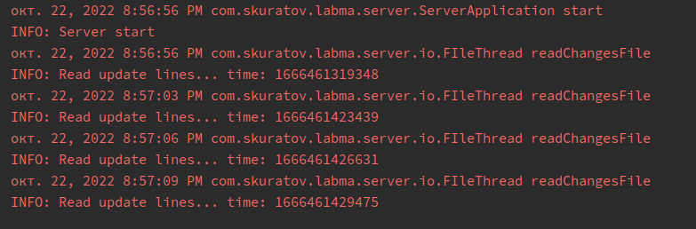
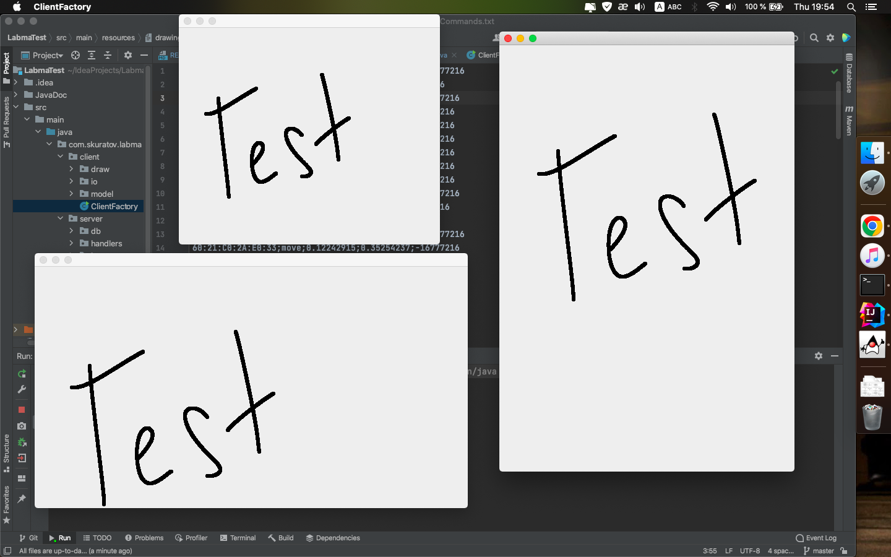
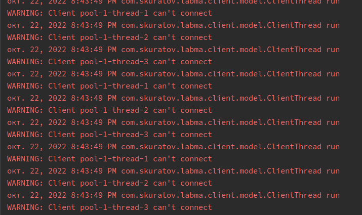

<h1 align="center"><a  href="https://github.com/Stas-ex/LabmaTest">LambaTest project</a> </h1>

## Description
There is a server application on which a "Common Board" object (an analogue of a regular school board) is created, on which you can "draw", and the connected client application (there may be many of them) receives (synchronizes) the board and receives online all the changes that come from the server application. <br><br>If a line is drawn in real time in the server application, then exactly the same line is drawn in real time in the client application.

**Server**

The server (own emulator) creates a [ServerSocket](https://docs.oracle.com/javase/7/docs/api/java/net/ServerSocket.html) on port 29288;

```java

try (ServerSocket serverSocket = new ServerSocket(29288)) {
        while (!serverSocket.isClosed()) {
        Socket clientSocket = serverSocket.accept();
        System.out.println("Client connection");
        listClient.add(new ClientHandler(clientSocket));
        }
    } catch (IOException e){}
}
```

After starting, the server starts reading commands from the [file](src/main/resources/drawingCommands.txt) and sending them to connected clients. To do this, a thread is created that checks the file's last modified date with a delay of 2 seconds.

```java
 scExecutorService.scheduleWithFixedDelay(new FIleThread(fileName), 0, 2, TimeUnit.SECONDS);
```

The data presented in the [file](src/main/resources/drawingCommands.txt) looks like: <br>
```
<unique device identifier>;
<action>;
<relative coordinate along the X-axis>;
<relative coordinate along the Y-axis>;
<color>\n
```

**Client**

Clients multipath connect to the server and start listening for commands;

```java
ExecutorService exec = Executors.newFixedThreadPool(3);
    for (int i = 0; i < 3; i++) {
        exec.execute(new ClientThread("localhost", 29288));
    }
    exec.shutdown();
}
```

**Bezier method**
When accepting such commands, clients draw curves at the points specified in the commands. When drawing curves, the [Bezier](src/main/java/com/skuratov/labma/client/draw/BezierGraphic.java) method (smoothing) is used.

To find the Bezier constant, the mathematical formula was used

```java
((fact(n) / (fact(i) * fact(n - i))) * Math.pow(t, i) * Math.pow(1 - t, n - i));
```
Params:
* fact - factorial method
* i - vertex number
* n - number of vertices
* t - curve position (from 0 to 1)

## Application work

To start the server, run the main method in the [ServerApplication.java](src/main/java/com/skuratov/labma/server/ServerApplication.java) class. <br>
The console will display up-to-date data on reading the file.



**Client**

To run multiple client threads, you need to run the main method in the [ClientApplication](src/main/java/com/skuratov/labma/client/ClientApplication.java) class. <br>
After the factory starts, empty client windows are created.
In case of a successful connection to the server, clients read data from the server in real time and convert it into a graphical form.



When using data in a [file](src/main/resources/drawingCommands.txt), reducing the image with a delay of 100 milliseconds


If the client fails to connect to the server, throw a [ConnectException](https://docs.oracle.com/javase%2F7%2Fdocs%2Fapi%2F%2F/java/net/ConnectException.html) until the client connects to the server.



## Setup
When creating the application, the following technologies were used:
1. Java 8
2. maven build tool 3.
3. Graphical interface - Swing/awt.

When starting the project, you will need to download the libraries using maven. You also need to download jdk 8 version.<br>
<br>Excellent! Now you can run the project. To do this, run the main method in classes: 
- [ServerApplication](src/main/java/com/skuratov/labma/server/ServerApplication.java)
- [ClientApplication](src/main/java/com/skuratov/labma/client/ClientApplication.java)

Method lookup procedure is not needed.

##You can contact me:

<a href ="https://t.me/StaseEx"></a>


